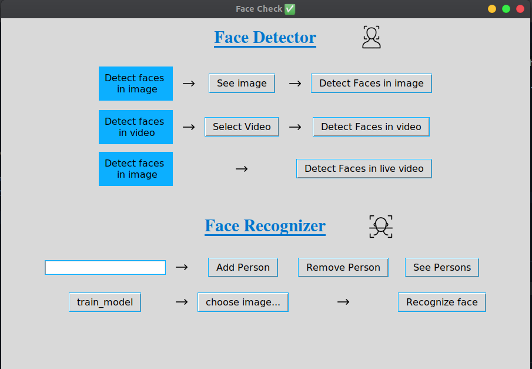

<h1 align="center">Welcome to Face Check ✅ 👋</h1>
<p>
  <a href="#" target="_blank">
    
  </a>
  <a href="https://twitter.com/anmolmalik01" target="_blank">
    
  </a>
</p>

> A openCV GUI App made in tkinter

### 🏠 [Homepage](https://github.com/anmolmalik01/Face-check)

## Install

```sh
git clone https://github.com/anmolmalik01/Face-check.git
```

## Usage

```sh
python3 main.py
```
## Demo




## Instructions

🔷 Face Detector<br>
◽ Image: Select an image and detect <br>
◽ Video: Select a video and detect faces in that video<br>
◽ Live Video: opens webcam and detects faces


🔷 Face Recognizer<br>
------------ How it runs ------------<br> 
◽ Add images in the images folder. Name the folder as the label( which will be shown under the image )<br>
◽ Add the person to the list **Person name should be same as folder name including uppercase.<br>
◽ Train the model **Model is pre-trained for the person pre available<br>
◽ Pick an image to predict<br>
◽ See the prediction


🔷 Extras<br>
◽ Press q twice to quit any program otherwise it will be stuck.<br>
◽ You can split images into training and test set.


🔷 Dependencies<br>
◽ OpenCV<br>
◽ numpy<br>
◽ Tkinter<br>
◽ PILLOW<br>
◽ scikit-learn<br>


## Author

👤 **Anmol**

* Twitter: [@anmolmalik01](https://twitter.com/anmolmalik01)
* Instagram: [@anmolmalik01](https://www.instagram.com/anmolmalik01/)

## 🤝 Contributing

Contributions, issues and feature requests are welcome!<br />Feel free to check [issues page](https://github.com/anmolmalik01/Face-check/issues). You can also take a look at the [contributing guide](https://github.com/anmolmalik01/Face-check/pulls).

## Show your support

Give a ⭐️ if this project helped you!

***
_This README was generated with ❤️ by [readme-md-generator](https://github.com/kefranabg/readme-md-generator)_